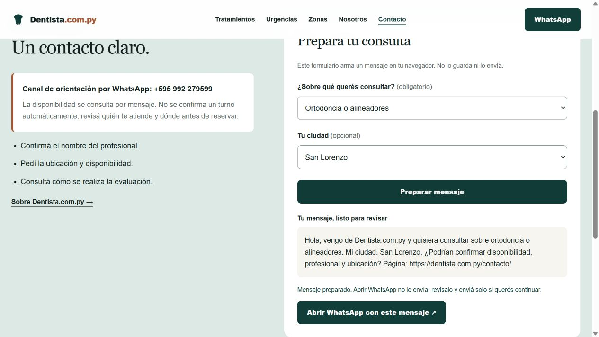
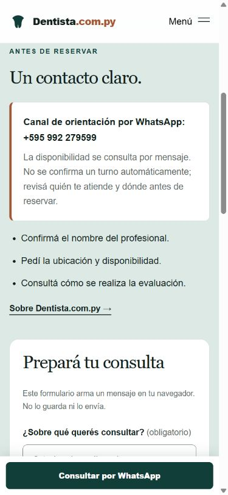
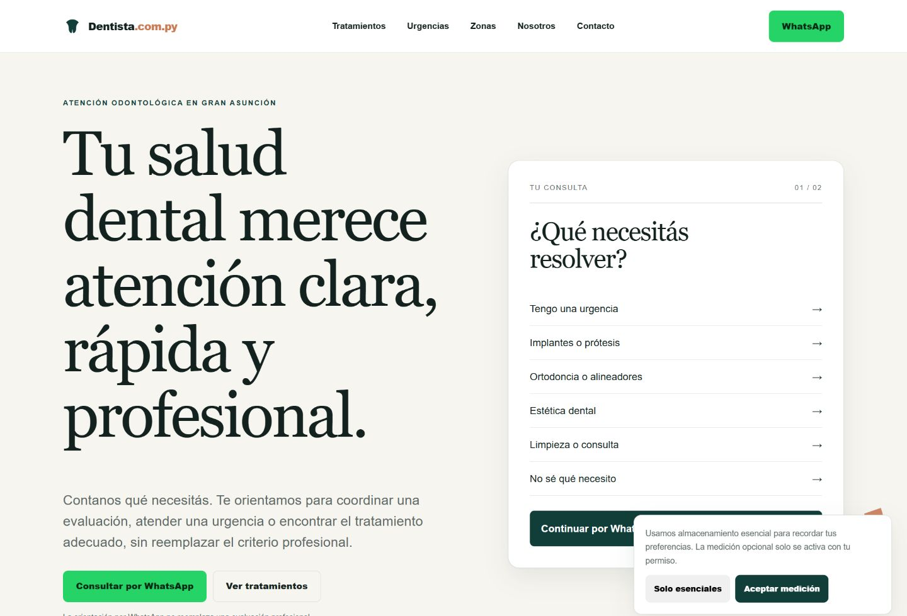
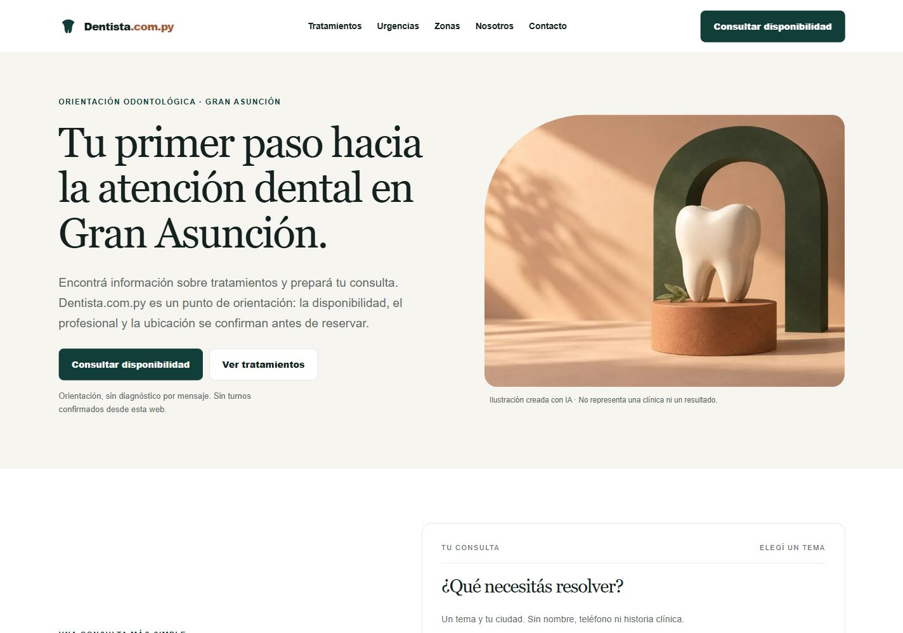
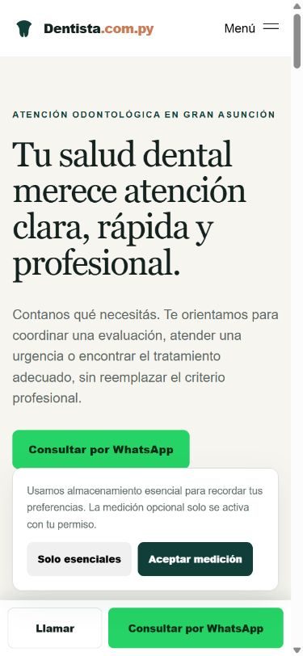
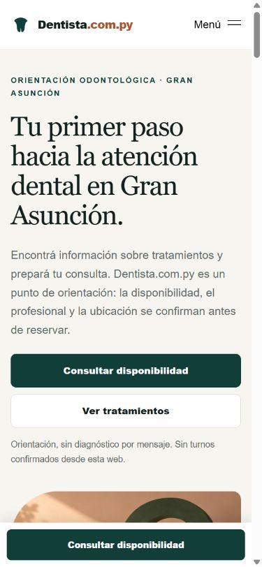
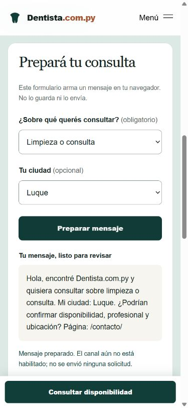

# Dentista.com.py — rapport 4 oktober 2026

## Leverans och status

En sammanhängande statisk version av hela den observerade publika sajten finns
i `site/`: startsida, 15 behandlingssidor, 8 områdessidor, 7 informationssidor
och en riktig 404-sida. De 31 publicerade URL:erna är bevarade. Kontaktkanalen
är aktiverad för **+595 992 279599**, bekräftat av Anton den 5 oktober 2026.
Alla WhatsApp-knappar anger sajt, aktuell sida och tjänst/ämne, även utan JS.
PR #9 är redo för merge och inte draft. Detta är **tekniskt testat och färdigt för granskning**;
publicering återstår efter besluten i [RELEASE.md](RELEASE.md).

## Vad livegranskningen visade

| Kontroll | Observerat live | Bedömning |
|---|---|---|
| 31 sitemap-sidor | Alla gav HTTP 200 | Inget verifierat sidbortfall |
| robots/canonical/schema | Indexering tillåten, canonical på eget domännamn, Organization/WebSite/WebPage/FAQ | Grundstrukturen bevarad |
| HTTP och www | 301 till HTTPS utan www | Fungerar live |
| Kontakt utan slash | 301 till /contacto/ | Fungerar live |
| Okänd URL | HTTP 404 | Fungerar live |
| WhatsApp | Riktiga länkar använde 595995628862 | Obekräftat vid granskningen; ersatt i leveransen av ägarbekräftat +595 992 279599 |
| Selector | Ett val uppdaterade sin WhatsApp-text; panelen visade 01 / 02 | Felaktig stegangivelse, ingen faktisk tvåstegsprocess |
| Mobilmeny | Öppnades; Escape stängde den inte | Verifierat tangentbordsproblem |
| Desktophero | Mycket stor rubrik, primär CTA nästan nere vid första skärmens slut | Prioriterings-/läsbarhetsproblem |
| Kontakt | WhatsApp och telefon, inget förfrågningsformulär på observerad kontaktsida | Ingen serverbaserad formulärintegration att bevara här |
| Cookiepanel | Erbjöd val av mätning, konfigurationens mät-ID:n var tomma | Tog utrymme utan en aktiv mätintegration |

Livegranskningen omfattade synlig desktop och mobil, startsida, kontakt,
implantsida och akutväg; samtliga sitemap-sidor lästes även via HTTP.
Ingen WhatsApp-sändning eller produktionslead gjordes.

## Källkonflikten och lösningen

GitHubs defaultgren var fortfarande
`claude/dentista-step-0-paraguay-5h7sqx`, SHA
`304e97be0568c866b7c23b26f657b2eaa9290bef`. Den innehåller den äldre statiska
versionen med `/tratamientos/*.html` och `595000000000` i sin konfiguration.
Detta är ett **repo-fel/äldre publiceringsläge**, inte det nummer som observerades live.

Även `main`, `claude/dentista-build-1`,
`claude/dentista-website-rebuild-jsz2si` och `claude/great-goldberg-4zmq7f`
inventerades. Ingen matchade livesajtens `/assets/css/main.css`,
`/assets/js/main.js`, navigering och sitemap. Inga öppna PR:er hittades vid start.

En separat checkout skapades i `dentista/` och arbetsgrenen
`codex/dentista-live-improvements` utgick från defaultgrenen. Den äldre
rotversionen har lämnats kvar som historisk källa. Den nya publiceringskatalogen
är isolerad i `site/` och bygger på sparad offentlig live-HTML. Ingen
äldre version har skrivits över på live. Användarens andra arbetskataloger
och ocommittade filer berördes inte. Ingen tillämplig AGENTS.md hittades i
checkouten eller de kontrollerade överordnade arbetskatalogerna.

Filspecifik proveniens finns i [live-source-manifest.json](live-source-manifest.json).
Originalsnapshots och originalbild finns lokalt i den separata
`dentista-delivery/`-katalogen utanför publiceringspaketet.

## Vad som förbättrats

- **Hela publicerade sidstrukturen:** alla befintliga sidor och sökbara URL:er
  är bevarade. Inga nya tunna stads- eller behandlingssidor har skapats.
- **Startsidan:** mindre rubrik, tydlig geografisk sökintention och synlig
  primär CTA tidigare på skärmen. H1 förklarar första steget till tandvård i
  Gran Asunción, i linje med sidans befintliga title och ortsintention.
- **Affärsrollen:** orientering före bokning, ingen påhittad egen klinik,
  namngiven tandläkare, matrikelnumer, adress, priser, recensioner eller resultat.
- **Kort förfrågningsväg:** ett ämne och valfri stad. Varken namn, telefon,
  fri sjukdomsbeskrivning, dokument eller kliniska uppgifter efterfrågas.
- **Selector:** korrekt stegangivelse, synligt valt ämne, `aria-pressed`,
  statusmeddelande och val som följer med till kontaktformuläret.
- **Kontakt:** felaktig/obekräftad konfigurering leder till begriplig återkoppling.
  Formuläret förbereder ett granskningsbart meddelande; öppning av WhatsApp är
  ett separat aktivt val och betyder inte att en bokning eller sändning lyckats.
- **Kontaktuppdatering 5 oktober:** bekräftat nummer på alla 163 statiska
  WhatsApp-länkar och 64 telefonlänkar. Varje WhatsApp-knapp anger Dentista.com.py,
  full aktuell sidlänk och relevant tjänst eller sidämne, även i sidhuvud,
  sidfot och mobilfält. Vald tjänst/stad synkroniseras till de övriga knapparna
  på samma sida. Kontaktkonfigurationens versionslänk ändras vid aktivering/reset
  så att en gammal cachad mottagare inte fortsätter användas.
- **Mobil/tangentbord:** tydligare knappar, läsbara block, stängning med Escape,
  återställd fokus, utanförklick/fokus stänger menyn, FAQ med native details.
- **Låg vikt:** en märkt AI-illustration, tre responsiva WebP-storlekar och
  rasterbild för social delning. Inga videor, fjärrfonter eller nya ramverk.
- **SEO:** canonical, robots och sitemap bevarade; ny fungerande JPEG för OG
  ersätter SVG som delningsbild. Ingen Dentist/LocalBusiness-schema med
  påhittad klinikinformation och inget obekräftat telefonnummer i Organization.
- **Privatliv:** inga analys-/annonsskript, kampanjlagring eller lagrade
  formulärvärden. Integritets-/cookieinformation beskriver faktisk funktion.
- **Publicering:** avgränsat zip-paket, legacy-redirects, 404, säkerhetsheaders,
  filskydd och checklista för kontroll i Hostinger.

Medicinskt innehåll på de befintliga behandlingssidorna har bevarats; inga nya
kliniska faktapåståenden, läkemedelsråd eller behandlingslöften har tillförts.
Detta uppdrag är ingen fullständig medicinsk innehållsgranskning.

## Tester och deras gränser

| Test | Resultat |
|---|---|
| Lokal statisk kontroll | 32 HTML-sidor, 31 sitemap-URL:er, 1 111 länkar/resurser; inga fel |
| Alla 31 URL:er över lokal HTTP | 200 på samtliga |
| Lokal felhantering | Okänd sida 404; /.env 403; /contacto → slash 301 |
| Kontaktregler | 6 automatiska tester passerade: gate, validering, encoding, queryfiltrering, sajt/ämne/full URL och isolerad kontext |
| Samtliga statiska kontaktknappar | 163 WhatsApp-länkar och 64 telefonlänkar på 32 sidor har rätt mottagare; varje WhatsApp-text har sajt, full sidlänk och relevant behandling/stad |
| Aktivering/reset | Obekräftad aktivering nekas; samtliga statiska länkar uppdateras; disable rensar samtliga externa kontaktmål |
| Formulär | Tomt ämne stoppas; ämne/stad förfylls; ändrat val döljer gammalt resultat |
| Lokalt avstängt läge | Meddelande visas och säger uttryckligen att inget skickats |
| Lokalt aktiverat mockläge | Ämne ortodoncia/alineadores, stad San Lorenzo och sidkontext når en lokal testmottagare |
| Visuell QA | Desktop 1440, mobil 390, surfplatta 768 och brytpunkt 1024; ingen horisontell scroll på kontrollerade vyer |
| Tangentbord | Escape/fokus i mobilmeny och Enter i FAQ verifierade |
| Bilder | Faktisk laddning verifierad; desktop- och mobilbilder granskade |
| Konsol | Inga varningar/fel på det kontrollerade kontaktflödet |

JS-syntax, URL-fragment, bilddimensioner/alt-text, JSON-LD-parsning,
canonical och att privata filer saknas i `site/` ingår i kontrollen.
Apache-regler, Hostinger-cache, riktig WhatsApp-mottagare och faktisk
leverans till en människa är **inte hosted-verifierade**. Ingen fullständig
WCAG-certifiering eller Lighthouse/Core Web Vitals-mätning påstås.

## Bilder och budget

En bild genererades via Higgsfield MCP: GPT Image 2.5, Sunburst, medium, 1k,
3:2. Exact preflight: **0,5 kredit**. Ett jobb slutfört, inga fel, variationer
eller omtagningar. MCP returnerade ingen separat slutdebitering; 0,5 är den
exakta offerten för det enda genomförda jobbet, inte en oberoende kontrollerad faktura.
Hård budget var 100 krediter. Ingen påfyllning, abonnemang eller video användes.

| Levererad bild | Storlek |
|---|---:|
| dental-art-360.webp | 4 390 byte |
| dental-art-640.webp | 8 992 byte |
| dental-art-960.webp | 15 888 byte |
| og-default.jpg, 1200×630 | 65 216 byte |

Prompten beskriver en keramisk tandskulptur på terrakottasockel med grön båge,
varm mjuk belysning och tydlig illustrationskaraktär. Inga människor, kliniker,
patientresultat eller före-/efterbevis. Den fullständiga prompten finns i
[image-prompt.txt](image-prompt.txt) och kostnadsloggen i
[higgsfield-budget.json](higgsfield-budget.json).

## Före och efter

Aktiverat kontaktflöde efter Antons nummerbekräftelse den 5 oktober:

Följande före-/efterbilder dokumenterar den första designförbättringen,
innan det bekräftade numret aktiverades.

Desktop före (live):

Desktop efter (lokal preview):

Mobil före och efter:

Kontaktflödet på mobil:

## Kort kvarvarande lista

Kontaktmottagaren är bekräftad och paketet uppdaterat. Bekräfta ansvarig
verksamhetsidentitet, godkänn `site/` som ny livekälla och gör Hostinger-kontrollerna.
PR #9 är redo för merge, inte draft;
ingen merge eller publicering har gjorts. Den observerade livesajten är oförändrad.
